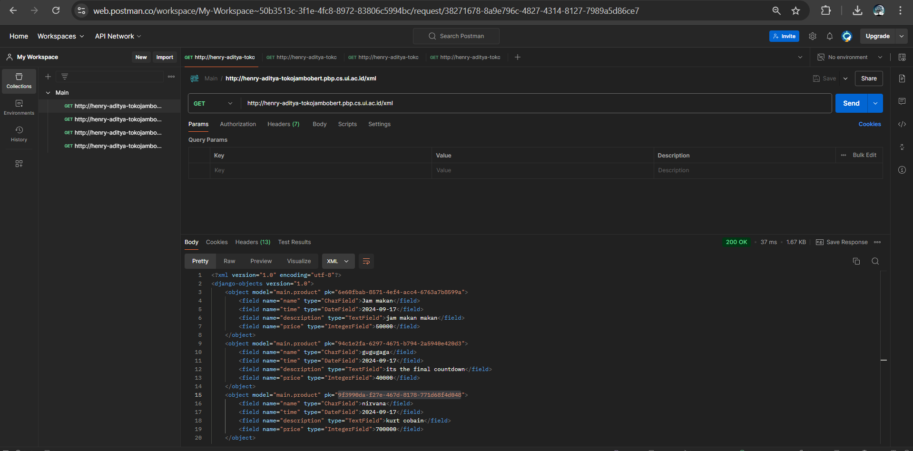
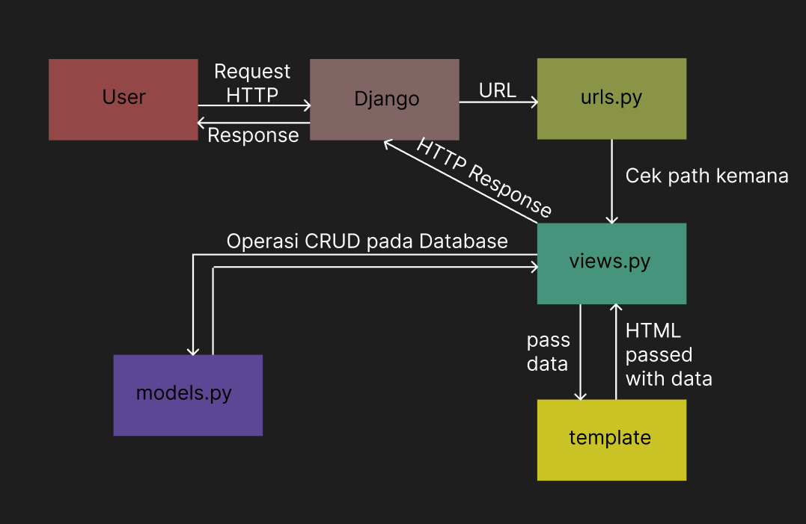

# Toko Jam Bobert


<h2>Website saya dapat diakses pada link: http://henry-aditya-tokojambobert.pbp.cs.ui.ac.id/</h2>
<h1>TUGAS 3</h1>

**<h3>Jelaskan mengapa kita memerlukan data delivery dalam pengimplementasian sebuah platform?</h3>**

Kita perlu data delivery ini karena kita perlu mengirim data atau menerima data dengan aman, akurat, dan efisien antar berbagai user platform.  Contoh dari data delivery yaitu XML dan JSON.
Pada platform yang sudah terdevelop dengan kompleks, sering ada berbagai komponen yang perlu untuk berkomunikasi satu dengan yang lain. Contohnya yaitu komunikasi antar frontend stack dan backend stack. Data delivery ini sangat terpakai karena terkadang data itu harus diantar secara real time, contohnya pada saat pengguna melakukan pembayaran online ovo gopay gitu atau di aplikasi chat yang harus cepat transmisi datanya.
Tanpa data delivery, platformnya kemungkinan besar jadi statis dan tidak interaktif. Tanpa data delivery, maka data yang diisi pada form tidak bisa sampai ke server. Tanpa data delivery, tidak ada jembatan untuk memindahkan data dari satu tempat ke tempat lainnya. 


**<h3>Menurutmu, mana yang lebih baik antara XML dan JSON? Mengapa JSON lebih populer dibandingkan XML?</h3>**
Sources: [source 1](https://aws.amazon.com/compare/the-difference-between-json-xml/)

Menurut saya, XML dan JSON punya kelebihannya dan kekurangannya masing-masing, meski sepertinya JSON lebih baik secara umum daripada XML. 
JSON memiliki ukuran file yang lebih kecil dan memiliki sekuritas yang lebih tinggi daripada XML. Hal ini disebabkan oleh struktur tag XML yang lebih kompleks dibandingkan JSON yang hanya menggunakan key-value,  struktur data XML juga rentan terhadap modifikasi sehingga menciptakan resiko keamanan yang dikenal sebagai XML external entity injection.  
XML juga perlu diparse menggunakan XML parser, sedangkan JSON diparse menggunakan standard JS function. Salah satu alasan yang membuat JSON lebih terkenal yaitu karena JSON lebih mudah dibaca dan tidak menggunakan tags. Seperti yang sudah saya jelaskan juga di paragraf sebelumnya, JSON memiliki file size yang lebih kecil dan data transmissionnya lebih cepat. Kesimpulannya, kita pakai XML ketika membutuhkan representasi data kompleks, lalu JSON untuk aplikasi yang membutuhkan pertukaran data cepat, ringan, dan lebih efisien.


**<h3>Jelaskan fungsi dari method is_valid() pada form Django dan mengapa kita membutuhkan method tersebut?</h3>**
Sources: [source 1](https://www.javatpoint.com/django-form-validation#:~:text=The%20is_valid()%20method%20is,data%20into%20a%20cleaned_data%20attribute)

Method is_valid() digunakan untuk mengecek validasi setiap field dari form, dimana method ini terdefinisi dalam Django Form class. Method ini akan meng return true jika datanya valid, lalu akan menaruh semua data yang terisi dalam form ke cleaned_data attribute.
Mungkin salah satu contoh yang saya kepikiran, yaitu ketika kita mau submit form dengan ada field yang masih kosong datanya. Ketika saya tidak isi lalu pencet button yang berfungsi untuk submit, maka fungsi is_valid() akan mengembalikan false dan formnya kasih pesan “please fill out this field”. Tanpa method ini, datanya nanti ada field yang kosong atau tidak sesuai dengan keinginan kita.


**<h3>Mengapa kita membutuhkan csrf_token saat membuat form di Django? Apa yang dapat terjadi jika kita tidak menambahkan csrf_token pada form Django? Bagaimana hal tersebut dapat dimanfaatkan oleh penyerang?</h3>**
Sources: [source 1, ](https://medium.com/@xploiterd/how-to-perform-and-exploit-cross-site-request-forgery-csrf-attacks-1764c0f23585)
[source 2](https://www.synopsys.com/glossary/what-is-csrf.html#:~:text=A%20CSRF%20token%20is%20a,token%20for%20every%20user%20session)

Sebelum menjelaskan alasan tersebut, kita perlu mengerti dulu apa itu csrf_token dan apa kegunaannya. Kata csrf berasal dari serangan siber CSRF yang kependekannya adalah Cross-Site Request Forgery. Cross-Site Request Forgery itu adalah jenis serangan di mana penyerang mencoba membuat user website melakukan aksi yang tidak diinginkan pada suatu web ketika usernya sudah terautentikasi.
Oleh karena hal tersebut, maka diciptakanlah yang namanya csrf_token, yaitu token yang berfungsi untuk mencegah serangan CSRF. Csrf_token ini merupakan sebuah string unik yang digenerate secara random. Token ini digunakan pada setiap formulir sehingga ketika server mendapat request, token csrf ini dipakai untuk verifikasi bahwa request itu asli, no fekfek, dan berasal dari user asli.
Jika kita tidak memakai csrf_token, tentunya akan menjadi rentan terhadap serangan siber CSRF yang sudah saya jelaskan di atas. Bisa saja CSRF memandu user untuk mengubah password akunnya, untuk mendapatkan informasi mengenai user, dan banyak lainnya.
Kalau saya lihat, berarti csrf_token ini tergenerate pada statement code  pada file create_product_entry.html, tepatnya setelah tag `<form>`.


**<h3>Jelaskan bagaimana cara kamu mengimplementasikan checklist di atas secara step-by-step (bukan hanya sekadar mengikuti tutorial).</h3>**
- Saya membuat forms.py, dimana model diambil dari class Product dalam models.py. Lalu fields yang diambil adalah name, description, dan price.
- Menambahkan 4 fungsi pada views.py

    ```py
    def show_xml(request):
        data = Product.objects.all()
        return HttpResponse(serializers.serialize("xml", data), content_type="application/xml")

    def show_json(request):
        data = Product.objects.all()
        return HttpResponse(serializers.serialize("json", data), content_type="application/json")

    def show_xml_by_id(request, id):
        data = Product.objects.filter(pk=id)
        return HttpResponse(serializers.serialize("xml", data), content_type="application/xml")

    def show_json_by_id(request, id):
        data = Product.objects.filter(pk=id)
        return HttpResponse(serializers.serialize("json", data), content_type="application/json")

    ```
- Membuat routing URL untuk masing-masing views yang telah ditambahkan pada poin 2.

    ```python
    urlpatterns = [
        #path('', show_main, name='show_main'),
        #path('create-product-entry', create_product_entry, name='create_product_entry'),
        path('xml/', show_xml, name='show_xml'),
        path('json/', show_json, name='show_json'),
        path('xml/<str:id>/', show_xml_by_id, name='show_xml_by_id'),
        path('json/<str:id>/', show_json_by_id, name='show_json_by_id'),
    ]
    ```
- Implementasi csrf_token terdapat pada statement code  pada file create_product_entry.html, tepatnya setelah tag `<form>`.
<h1>1. Json ambil semua</h1>

 
<h1>1. Xml ambil semua</h1>

 
<h1>1. Json ambil specified id</h1>

 
<h1>1. Xml ambil specified id</h1>


<br><br>
<h1>TUGAS 2</h1>

**<h3>Jelaskan bagaimana cara kamu mengimplementasikan checklist di atas secara step-by-step (bukan hanya sekadar mengikuti tutorial).</h3>**
1. Pertama-tama, saya membuat direktori lokal bernama toko-jam-bobert pada desktop saya.
2. Setelah itu saya menambahkan file README.md, membuat repo baru pada akun Github saya dan menginisialisasikannya dengan lokal.
3. Lalu melakukan set up environment, membuat dan mendownload text requirements, membuat proyek django baru menggunakan `git startproject`, membuat file gitignore, dan add commit push.
4. Setelah melakukan startproject dan melakukan push, saya melakukan `python manage.py startapp main` dan menambahkan app tersebut ke dalam `settings.py INSTALLED_APPS` pada direktori proyek `toko_jam_bobert`.
5. Sehabis itu, saya membuat model `Product` dalam models.py dengan atribut `nama, description, dan price`.
6. Lalu saya membuat fungsi show_main pada `views.py` untuk menampilkan `main.html` dan mengatur `urls.py` pada direktori main dan juga pada direktori toko_jam_bobert.
7. Terakhir, melakukan deployment dengan menambahkan pws `git remote add pws link`, lalu melakukan git mantras `add, commit, dan push terhadap origin dan juga pws`.

**<h3>Buatlah bagan yang berisi request client ke web aplikasi berbasis Django beserta responnya dan jelaskan pada bagan tersebut kaitan antara urls.py, views.py, models.py, dan berkas html.</h3>**

 
1. urls.py menerima url yang sudah diambil dari HTTP yang dikirim oleh user. Lalu urls.py akan mengdirect dan akan membuka views yang mana berdasarkan url yang diterima tadi.
2. views.py akan memproses data yang diperlukan berdasarkan request. Disinilah views.py akan berhubungan dengan data yang ada dalam models.py. Lalu akan mengirimkan data tersebut ke dalam template HTML.
3. views lalu merender template menjadi HTML dan mengembalikannya sebagai response.

**<h3>Jelaskan fungsi git dalam pengembangan perangkat lunak!</h3>**
Git adalah *tools version control system* yang digunakan untuk mengelola perubahan kode selama pengembangan perangkat lunak. Berikut beberapa fungsi utama dari git:
1. Untuk Melacak dan Menyimpan Perubahan Kode<br>
Git memungkinkan user untuk melihat dan menyimpan perubahan yang terjadi pada kode. Jika terdapat perubahan baru terhadap kode, kita bisa melakukan git add, commit, dan push ke dalam repo untuk mengupdate versi terbaru dari perubahan kode kita. Jika terdapat kesalahan pada kode yang sekarang, kita bisa mengubah git ke versi sebelumnya karena git menyimpan perubahan-perubahan yang kita lakukan.

2. Untuk Mengerjakan Project Bersama Orang Lain<br>
Tentunya kita akan diperhadapkan dengan situasi dimana kita perlu bekerja sama dengan orang lain. Dengan adanya git, git memungkinkan banyak user untuk bekerja sama pada repo github yang sama.

3. Untuk Memudahkan Pengelolaan Versi<br>
Setiap perubahan yang dibuat dapat diberi label dengan versi tertentu menggunakan tag. Misalnya, jika setelah perilisan sebuah versi dengan tag 2.0 ditemukan bug, user bisa memperbaiki bug pada versi itu karena sudah ada tagnya.

**<h3>Menurut Anda, dari semua framework yang ada, mengapa framework Django dijadikan permulaan pembelajaran pengembangan perangkat lunak?</h3>**
Menurut saya sendiri, alasan pertamanya yaitu karena Django *beginner friendly* sehingga mudah untuk dipelajari, praktis, simpel, dan efisien. Selain itu, bahasa yang digunakan dalam Django adalah `Python`, dimana kita sudah mempelajari bahasa pemrograman tersebut pada Semester 1. Django juga menyediakan banyak fitur bawaan, seperti autentikasi, pengelolaan database, dan sistem template, yang memungkinkan pengembang fokus pada logika aplikasi tanpa harus membangun banyak hal dari nol. Selain itu, Django memiliki komunitas yang besar sehingga terdapat banyak sumber dalam internet mengenai tutorial Django bagi pemula.

**<h3>Mengapa model pada Django disebut sebagai ORM?</h3>**
Model pada Django disebut sebagai ORM atau *Object Relational Mapping* karena dia menghubungkan objek Python secara langsung ke tabel-tabel dalam basis data, dimana setiap atribut yang ada pada model akan diubah menjadi kolom pada tabel dalam database. Dengan ORM, kita dapat melakukan operasi CRUD pada database tanpa harus menulis query SQL secara langsung.